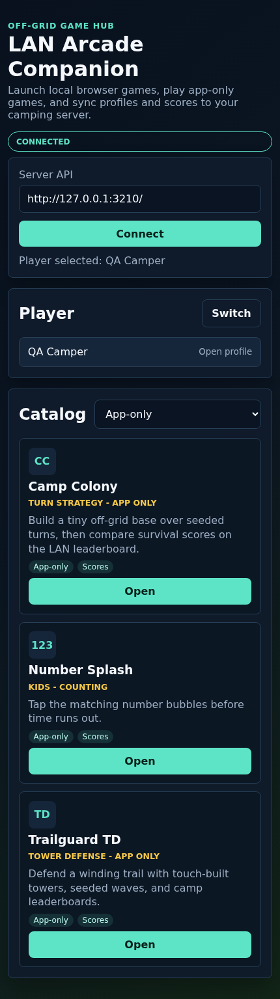
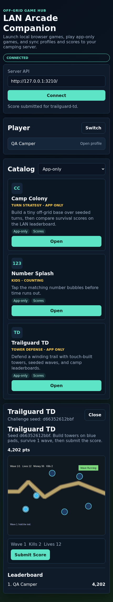
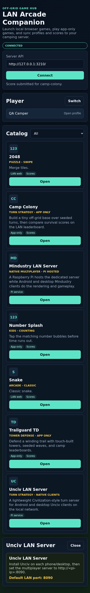

# LAN Arcade

Self-hosted **offline browser game arcade** that sets itself up with a single script.

LAN Arcade is a small project I built so my kids can enjoy fun browser games and a taste of what the old web used to feel like – without all the ads, tracking, loot boxes and “please sign up” pop-ups that come with the modern internet. Everything runs locally on our own network, no accounts needed and no data going anywhere.

It’s lightweight enough to host on a Raspberry Pi or tiny VM, so you can throw it in a bag for long road trips or holidays. Power it up, connect devices to its Wi-Fi or LAN, and the kids get a fast, ad-free game portal that works even when there’s no internet at all.

**This is unfinished BETA - assume nothing works**

This repo contains:

- `setup_lan_arcade.sh` – installer + HTML generator
- `games.meta.sh` – list of games and metadata (titles, icons, descriptions, tags, categories)
- `local-games` – original bundled games that are copied into the mirror without internet dependencies
- `apps/companion` – React/Capacitor companion app for Android + browser/PWA
- `services/arcade-api` – local Node/SQLite API for profiles, scores, leaderboards, and challenges
- `services/lan-tank-arena` – local WebSocket server for the browser-based LAN Tank Arena multiplayer game
- `services/mindustry` – optional Pi-hosted Mindustry dedicated server container
- `services/unciv` – optional Pi-hosted Unciv multiplayer turn-file server container
- `packages/shared` – shared app/API contracts

The script mirrors a bunch of HTML/JS games (mostly idle / clicker / educational) into
`/var/www/html/mirrors/` and builds a nice card-based homepage at:

> `/var/www/html/mirrors/games/index.html`

So anyone on your LAN can visit:

```text
http://<server-ip>/mirrors/games/
```

# Features

- 🕹 Offline-friendly – games are mirrored locally with wget
- 🎨 Pretty UI – card-based public index generated from `catalog.json`
- 🗂 Category-aware – public category chips + admin filters across educational, ages 5+/10+/13+, maths, english, typing, and genre categories
- 🔐 Admin controls – password-protected admin page to disable full categories or individual games
- 📚 Offline wiki – local wiki page with docs + searchable game catalog at `/mirrors/games/wiki/`
- 🧪 QA harness – static, desktop, mobile, per-game, and multiplayer smoke checks
- 🔁 Idempotent – safe to rerun; completed game folders are skipped via marker files
- 🧩 Easy to extend – update URLs, card data, and categories in `games.meta.sh`

# Original bundled games

The repo now includes a few original games under `local-games/`. These are copied into `/var/www/html/mirrors/` by the installer, so they do not depend on GitHub Pages, CDNs, trackers, remote fonts, or third-party runtime assets.

- `Outpost Siege` – tower defense with waves, tower upgrades, boss pressure, and local save progress.
- `Breachline Tactics` – turn-based grid tactics with squad abilities, enemy turns, and best-depth tracking.
- `Circuit Foundry` – compact factory automation with generators, extractors, belts, smelters, and assemblers.
- `LAN Tank Arena` – browser-based LAN multiplayer tank combat backed by the local WebSocket service.

# Requirements
On the machine you’re deploying to:
- Debian/Ubuntu/Raspberry Pi OS (or similar)
- bash
- Internet access for the first run (to mirror the games)
- git installed
The script will install these packages automatically:
- apache2
- apache2-utils
- wget
- unzip
- nodejs
It’s been used on:
- A Debian VM
- Raspberry Pi-class hardware should also be fine

# Quick start – install on your server

These are the steps someone else would follow on their Debian/Ubuntu/RPi box.

1. Install git (if needed)
```
sudo apt update
sudo apt install -y git
```

2. Pick an install directory
This repo doesn’t have to live in /opt, but it’s a nice conventional place.
```
sudo mkdir -p /opt/lan-arcade
sudo chown "$USER":"$USER" /opt/lan-arcade
cd /opt/lan-arcade
```
3. Clone the repo
```
git clone https://github.com/DylanGWork/LAN_Arcade.git .
```

You should now see:
```
/opt/lan-arcade
  ├─ setup_lan_arcade.sh
  ├─ games.meta.sh
  └─ README.md
```

Make the setup script executable (one-time):
```
chmod +x setup_lan_arcade.sh
```

4. Run the setup script
```
sudo ./setup_lan_arcade.sh
```

You’ll be asked:
```
Enter a name for your LAN arcade (e.g. 'GannanNet', 'SmithNet', 'Magical LAN') [GannanNet]:
```

On first run you’ll also be asked to set an admin password for the protected admin panel.

Whatever you type becomes the ```<title>``` and ```<h1>``` on the homepage
(e.g. SmithNet LAN Arcade). Press Enter to accept the default.

The script will then:
1. Install Apache + helper tools (if they’re not already installed)
2. Create or reuse admin credentials
3. Mirror each configured game into /var/www/html/mirrors/<game>/
4. Build `/var/www/html/mirrors/games/catalog.json`
5. Regenerate `/var/www/html/mirrors/games/index.html` (public page)
6. Regenerate `/var/www/html/mirrors/games/wiki/index.html` (offline wiki page)
7. Regenerate `/var/www/html/mirrors/games/admin/index.html` + save endpoint
8. Configure Apache Basic Auth for `/mirrors/games/admin/`
9. Enable the `lan-tank-arena` systemd service for the browser multiplayer tank game
    🔧 You do not run games.meta.sh yourself.
    It’s automatically loaded by setup_lan_arcade.sh and used as a config file.

5. Open the arcade
On any device on the same network:
```
http://<server-ip>/mirrors/games/
```
If you access it from the server itself you can usually use:
```
http://localhost/mirrors/games/
```
You should see a grid of cards with:
- Game title
- Genre meta line (e.g. UTILITY · INCREMENTAL)
- Short description
- Tag “pills”
- Category filter chips at the top of the page
- Play button with a little emoji
Click a card to launch the game.

Admin panel (login required):
```text
http://<server-ip>/mirrors/games/admin/
```
Use it to disable:
- Whole categories (e.g. `age-13-plus`, `maths`, `typing`)
- Individual games

The public index automatically applies those saved filters.

LAN Tank Arena:
```text
http://<server-ip>/mirrors/lan-tank-arena/
```

The full installer enables `lan-tank-arena.service` and listens on port `8787` by default. Players enter a callsign and a shared room code, then join from phones, tablets, or laptops on the same LAN.

Useful service checks:
```
systemctl status lan-tank-arena.service
curl http://127.0.0.1:8787/tank-arena/healthz
```

Offline wiki (no login required):
```text
http://<server-ip>/mirrors/games/wiki/
```
Use it as a LAN-local reference for:
- Game list + search/filter
- Category/tag overview
- Admin control instructions
- Important files/paths

# Admin controls

Admin URL (HTTP Basic Auth):
```text
http://<server-ip>/mirrors/games/admin/
```

The admin page has three main actions:
- **Save Changes**: writes your current checkbox selections to `/var/www/html/mirrors/games/admin.filters.json`.
- **Enable All**: unchecks all category/game disables in the UI. Click **Save Changes** after this to persist.
- **Reload From Disk**: reloads catalog + filters from disk and discards unsaved UI state.

Recommended workflow:
1. Disable categories and/or individual games.
2. Click **Save Changes**.
3. Open the public page and verify visibility.
4. If you want to undo all filtering, click **Enable All** then **Save Changes**.

Credential behavior:
- First setup prompts for admin password unless `ADMIN_PASSWORD` is already provided.
- On reruns, existing credentials are reused if `ADMIN_PASSWORD` is not set.
- To rotate password:
```
ADMIN_PASSWORD="new-strong-password" sudo ./setup_lan_arcade.sh
```
- To rotate username + password:
```
ADMIN_USER="newadmin" ADMIN_PASSWORD="new-strong-password" sudo ./setup_lan_arcade.sh
```
- `ADMIN_USER` allows letters, numbers, `.`, `_`, and `-`.

# Updating / redeploying

Whenever you pull new changes from git (e.g. new games added):
```
cd /opt/lan-arcade
git pull
sudo ./setup_lan_arcade.sh
```

The script is safe to rerun:
- Existing game folders are left in place (no re-download unless you delete them)
- Catalog and pages are rebuilt every run so metadata/category changes appear automatically

# QA / offline validation

This repo includes a first-pass QA harness for checking whether mirrored games actually load and tolerate basic interaction in a browser.

Install QA dependencies:
```
npm install
npx playwright install chromium
```

Static mirror audit:
```
npm run qa:static
```

Browser smoke test:
```
npm run qa:smoke
```

Catalog smoke test, including games hidden by admin filters:
```
npm run qa:smoke:catalog
```

Mobile/touch smoke test:
```
npm run qa:smoke:mobile
```

Focused regression gate for a new or touched game:
```
npm run qa:game -- outpost-siege
```

LAN Tank Arena two-client multiplayer smoke test:
```
npm run qa:tank
```

Catalog chunking for longer regression runs:
```
npm run qa:smoke -- --catalog --offset 20 --limit 20 --report-dir qa/reports/catalog-batch-2
```

Quarantine blocker games from the latest catalog report:
```
node qa/quarantine-blockers.mjs \
  --report qa/reports/latest-regenerated/smoke-report.json \
  --filters /var/www/html/mirrors/games/admin.filters.json
```

The browser smoke test blocks outbound internet requests by default. Reports are written to:
```
qa/reports/latest/
```

On the current VM, nginx already serves `/var/www/html/mirrors`, so use the safe regeneration command in `docs/VM_DEVELOPMENT_AND_QA.md` when you only want to rebuild catalog/pages without changing web-server packages or Apache auth.

See `docs/VM_DEVELOPMENT_AND_QA.md` for the VM notes, current baseline, safe regeneration command, and the recommended game admission process.

# Companion app

This repo now includes a first-pass LAN Arcade Companion app. It connects to a selectable LAN Arcade server, shows the existing mirrored game catalog, creates local player profiles, tracks scores, and includes bundled app-only games:

- `Trailguard TD` – original Phaser tower defense game with seeded challenge leaderboards.
- `Camp Colony` – original turn-based base-builder with seeded challenge leaderboards.
- `Number Splash` – simple counting game for younger kids.
- `Mindustry LAN Server` – optional Pi-hosted native multiplayer server card for Android/desktop Mindustry clients.
- `Unciv LAN Server` – optional Pi-hosted turn-strategy server card for Android/desktop Unciv clients.

The handoff is intentionally similar to the PestSense WiFi provisioning app pattern:
keep a direct APK artifact in the repo and expose it on the LAN server so phones
can install it without hunting through build folders.

Current APK:

```text
releases/android/lan-arcade-companion-debug.apk
```

After `sudo ./setup_lan_arcade.sh`, the APK is copied to the offline download page:

```text
http://<server-ip>/mirrors/games/downloads/
http://<server-ip>/mirrors/games/downloads/lan-arcade-companion-debug.apk
```

On Android, install the APK and set the server field to:

```text
http://<server-ip>/arcade-api/
```

Screenshots:







Useful commands:

```
npm run dev:api
npm run dev:companion
npm run qa:companion
npm test
npm run build
```

Android SDK/JDK setup and APK build:

```
scripts/setup_android_sdk.sh
scripts/build_companion_apk.sh
scripts/publish_companion_apk.sh
```

See `docs/COMPANION_APP.md` for API endpoints, nginx deployment notes, Android status, and QA details. See `docs/STRATEGY_GAME_SPIKE.md` for the Freeciv-web and Unciv strategy-game spike notes.

# Customisation
Change the arcade name (title/header)

Two options:
- Interactive – just type a new name at the prompt when you run the script.
- Non-interactive – set ARCADE_NAME in the environment:
```
ARCADE_NAME="Magical LAN" sudo ./setup_lan_arcade.sh
```

Set admin credentials non-interactively:
```
ADMIN_USER="arcadeadmin" ADMIN_PASSWORD="strong-password" sudo ./setup_lan_arcade.sh
```

If admin credentials already exist and `ADMIN_PASSWORD` is omitted, existing credentials are kept.
If you run in a non-interactive environment and credentials do not exist yet, you must set `ADMIN_PASSWORD`.

# Add or edit games (for people hacking on the repo)

All game definitions live in games.meta.sh.

1. Add a new game source URL
In the **GAMES** array:
```
declare -A GAMES=(
  # existing entries...

  ["my-new-game"]="https://example.github.io/my-new-game/"
)
```

Special cases:
- `ZIP_GITHUB_REPO::owner/repo::branch` downloads a repo ZIP and copies its extracted files into the game folder.
- `GIT_GITHUB_REPO::owner/repo::branch` performs a shallow git clone with submodules and copies files into the game folder (useful when ZIP archives omit submodule content).
- `ZIP_GITHUB_REPO` remains as a legacy shortcut for the existing `typing-test` source.
- `ZIP_GITHUB_FILE::owner/repo::branch::path/to/file.html` downloads a repo ZIP and promotes that file to `index.html`.
- For `ZIP_GITHUB_REPO::...`, if the repo has no `index.html`, the first discovered HTML file is copied to `index.html`.

Example:
```
["crossword-classic"]="ZIP_GITHUB_REPO::deepakshajan/Crossword-Puzzle::master"
["game-of-sums"]="ZIP_GITHUB_FILE::jkanev/educational-html-games::master::game-of-sums.html"
```

2. Add pretty card metadata
In the GAME_INFO array, add a line using:
```
["my-new-game"]="Nice Game Title|🎮|GENRE · SUBGENRE|Short one-line description.|PrimaryTag,SecondaryTag"
```
- Title – card heading
- Icon – emoji shown in the Play button
- META line – small caps genre row (e.g. SPACE · IDLE)
- Description – short blurb for the card
- Tags – comma-separated list. First tag gets the highlighted pill style.

3. Add categories used by admin filtering
In the GAME_CATEGORIES array:
```
["my-new-game"]="educational,typing,english,age-10-plus"
```

Suggested category style:
- Audience: `age-5-plus`, `age-10-plus`, `age-13-plus`
- Learning: `educational`, `maths`, `english`, `typing`
- Genre/theme: `arcade`, `puzzle`, `idle`, `strategy`, `simulation`, `rpg`, etc.

If a folder exists under /var/www/html/mirrors/ but isn’t in GAME_INFO,
the script falls back to a generic “HTML5 · Offline” card for that folder.

4. Run the setup script again

After editing games.meta.sh and committing/pushing if you’re using git:
```
# on the server
cd /opt/lan-arcade
git pull           # if you pushed from your dev machine
sudo ./setup_lan_arcade.sh
```
You’ll get updated cards and any new games will be mirrored.

# Recommended dev workflow

For people maintaining the project:
1. On your main computer
- Clone this repo.
- Open it in VS Code.
- Edit games.meta.sh / setup_lan_arcade.sh.
- Commit and push using git.

2. On your server / VM / Pi
- cd /opt/lan-arcade
- git pull
- sudo ./setup_lan_arcade.sh

This is exactly the flow a “real” user would follow.

# Notes

- Games are mirrored for personal / LAN / offline use.
Please respect original licences and don’t publicly rehost in ways the authors
wouldn’t approve.
- First run needs internet to download the games. After that, everything
runs from your server.
- Script currently targets Debian-style systems. Other distros may need tweaks
to package names and service commands.
